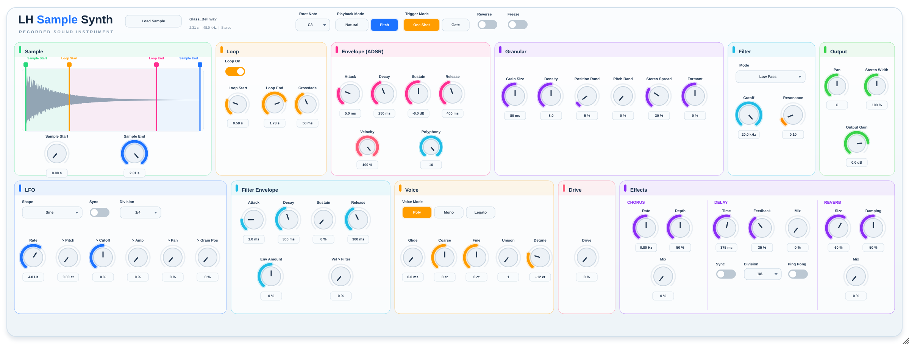

# LH Sample Synth

A recorded-sound instrument plugin. You load a recording (a bucket, a plate, glass, a voice, a metal
object, a field recording, a percussion hit) and it becomes the sound source you play from MIDI.



* Formats: **VST3**, **CLAP** (Windows, macOS, Linux) and **AU** (macOS only). A Standalone app is built too.
* **Pitch mode** uses duration-preserving granular pitch shifting. A 1.2 s recording lasts about
  1.2 s at C2, C3 and C4. **Natural mode** uses classic resampling, so speed and pitch change together.
* Synth section: LFO (tempo sync), filter envelope, velocity→filter, glide with Poly/Mono/Legato,
  coarse/fine tune, unison, drive and a chorus/delay/reverb effect chain.
* 16-voice polyphony, ADSR, One Shot / Gate, crossfaded looping, reverse, freeze, granular
  texture controls, LPC formant shifting, a multimode filter, and pan, width and output gain.
* C++20, JUCE 8, CMake. License: AGPLv3.

## Building

Clone with submodules:

```
git clone --recursive https://github.com/shenphenchoedron-hue/LH-Sample-Synth.git
cd LH-Sample-Synth
# (existing clone: git submodule update --init --recursive)
```

**Windows** (Visual Studio 2022, x64):
```
cmake -S . -B build -G "Visual Studio 17 2022" -A x64
cmake --build build --config Release
```

**macOS** (Apple Clang, universal arm64 + x86_64):
```
cmake -S . -B build -DCMAKE_BUILD_TYPE=Release
cmake --build build
```

**Linux** (GCC or Clang):
```
sudo apt install libasound2-dev libx11-dev libxrandr-dev libxinerama-dev libxcursor-dev \
     libxext-dev libfreetype6-dev libfontconfig1-dev libgl1-mesa-dev
cmake -S . -B build -DCMAKE_BUILD_TYPE=Release
cmake --build build
```

Tests: `ctest --test-dir build -C Release --output-on-failure`

AU is added to the format list only when `APPLE` is true. It is never configured on Windows or Linux.

### Outputs

| Format | Path |
|---|---|
| VST3 | `build/LHSampleSynth_artefacts/Release/VST3/LH Sample Synth.vst3` |
| CLAP | `build/LHSampleSynth_artefacts/Release/CLAP/LH Sample Synth.clap` |
| AU (macOS) | `build/LHSampleSynth_artefacts/Release/AU/LH Sample Synth.component` |
| Standalone | `build/LHSampleSynth_artefacts/Release/Standalone/` |

### Install locations

| | VST3 | CLAP | AU |
|---|---|---|---|
| Windows | `C:\Program Files\Common Files\VST3\` | `C:\Program Files\Common Files\CLAP\` | – |
| macOS | `~/Library/Audio/Plug-Ins/VST3/` | `~/Library/Audio/Plug-Ins/CLAP/` | `~/Library/Audio/Plug-Ins/Components/` |
| Linux | `~/.vst3/` | `~/.clap/` | – |

Builds made locally on macOS are not signed. Run `codesign --force --deep -s - <bundle>` if your host refuses to load them.

## Controls

| Section | Controls |
|---|---|
| Header | Load Sample (or drag and drop a file), file name / duration / sample rate / channels, Root Note (default C3 = MIDI 60), Natural / Pitch, One Shot / Gate, Reverse, Freeze |
| Sample | Waveform with draggable Sample Start, Sample End, Loop Start and Loop End markers. Sample Start and Sample End knobs |
| Loop | Loop On, Loop Start, Loop End, Crossfade (0–1000 ms) |
| Envelope | Attack, Decay, Sustain, Release, Velocity (sensitivity), Polyphony (1–16) |
| Granular | Grain Size (10–500 ms), Density (1–32 overlapping grains), Position Randomness, Pitch Randomness, Stereo Spread, Formant (−100…+100 %) |
| Filter | Mode (Low Pass / High Pass / Band Pass), Cutoff, Resonance |
| Output | Pan, Stereo Width (0–200 %), Output Gain (−48…+12 dB) |
| LFO | Shape (Sine/Triangle/Square/Saw/Random), Rate or tempo Sync + Division, depth to Pitch (semitones), Cutoff, Amp (tremolo), Pan, Grain Position |
| Filter Envelope | Attack, Decay, Sustain, Release, Env Amount (±6 octaves), Velocity > Filter |
| Voice | Poly / Mono / Legato, Glide, Coarse (±24 st), Fine (±100 ct), Unison (1–4 voices), Detune |
| Drive | Soft tanh saturation per voice (before the filter) |
| Effects | Chorus (Rate, Depth, Mix), Delay (Time or Sync + Division, Feedback, Mix, Ping Pong), Reverb (Size, Damping, Mix) |

Every control is an automatable parameter with a stable ID (`src/parameters/ParameterIDs.h`). The engine also responds to pitch bend (±2 semitones) and to CC 120 and CC 123.

## Architecture

```
src/PluginProcessor.*      Format-neutral JUCE AudioProcessor: APVTS, state, sample loading
src/PluginEditor.*         GUI on a 2400x540 design canvas, scaled to fit the window
src/engine/                InstrumentEngine (MIDI, mixing, output), VoiceManager, Voice, Envelope,
                           SampleData (immutable), SampleLoader, SampleStore (lock-free swapping),
                           SampleRegion (clamping)
src/dsp/                   GranularPitchProcessor + Grain, NaturalPlaybackProcessor, FormantProcessor,
                           MultimodeFilter, Lfo, Effects (chorus, delay, drive), ParameterSmoother,
                           SampleReader (shared interpolation/loop logic)
src/gui/                   WaveformView, Knob / ChoiceSegment, LHLookAndFeel
src/parameters/            Parameter IDs and layout
tests/                     Unit tests (JUCE UnitTest)
```

The engine has no dependency on VST3, AU or CLAP. JUCE wraps the same processor for VST3, AU and
Standalone, and clap-juce-extensions wraps it for CLAP.

### Signal flow per voice
source (Natural or granular) → formant → drive → filter (cutoff + filter env + LFO + velocity) →
amp envelope × velocity × tremolo × pan → mix → chorus → delay → reverb → width/pan → gain → limiter.
Modulation (LFO, glide, filter envelope) is evaluated every 64 samples; gains are ramped
per sample. Granular grains follow glide/vibrato continuously.

### Granular pitch shifting
Each voice runs two clocks. The **traversal** playhead moves through the file at its natural speed
(source rate ÷ host rate), so the note's duration does not change. Every `grainSize / density`
samples a Hann-windowed grain starts at the playhead. Each grain reads the file at
`naturalSpeed × 2^((note − root)/12)`, so the grain's content carries the pitch.

A grain's start is offset so its centre lines up with the playhead. Before it starts, its position
is moved by up to ±12 ms to the point that best matches, by cross-correlation, what the previous
grain is playing (WSOLA-style). Without this step, tonal material is detuned by comb-filtering
between grains. Position and Pitch Randomness gradually turn this alignment off, which gives
deliberately synthetic, cloud-like textures.

Freeze stops the playhead while grains keep being generated. Reverse flips both the playhead and
the direction grains read in.

### Formant processing
`FormantProcessor` analyses each voice's shifted signal every 128 samples using LPC (order 12,
512-sample Hann window, Levinson-Durbin). It warps the resulting spectral envelope by
`q = ratio^(−Formant)`:

* 0 %: bypassed, so formants move with the pitch
* +100 %: the original formants are restored
* −100 %: formants move twice as far as the pitch

It then whitens the signal with an FIR lattice and recolours it with an IIR lattice built from the
warped envelope. Reflection coefficients are interpolated per sample, and the loudness is matched
to the input.

### Sample replacement
Files are decoded on a loader thread into an immutable `SampleData`. `SampleStore` keeps ownership
of every sample and passes the raw pointer to the audio thread through an atomic exchange. Each new
block adopts the latest sample for **new** voices only. A voice that is already sounding keeps its
own sample and holds it through an atomic reference count. The message thread frees an old sample
only when both of these are true:

* it is older than the sample the audio thread has acknowledged
* no voice is still using it

The audio thread never allocates, locks or frees memory.

### State
The saved state contains:

* every APVTS parameter (mode, loop, region and the rest)
* the sample's file path

The audio is never embedded in the state. On restore, the file is loaded again in the background.
If the file is missing:

* all parameters are still restored
* the path is kept, so saving again does not lose it
* the GUI shows the sample as missing

After a restore, the plugin asks the host to re-read parameter values.

## Limitations
* Granular pitch shifting is a time-domain method. Large shifts (more than ±1 octave) on dense,
  polyphonic material can sound grainy or smeared. Monophonic and percussive sources work best.
* The formant stage uses an order-12 all-pole model. It captures broad resonances such as body and
  vowel colour, but not fine spectral detail.
* CPU: 16 looping voices in Pitch mode with Formant enabled took about 30 % of one core at 48 kHz
  on the test machine. Natural mode costs much less.
* When a saved sample file has moved, you have to load it again manually. There is no automatic
  search.
* The CLAP wrapper cannot report a rejected state blob. It returns success for garbage data, which
  the plugin ignores safely.
